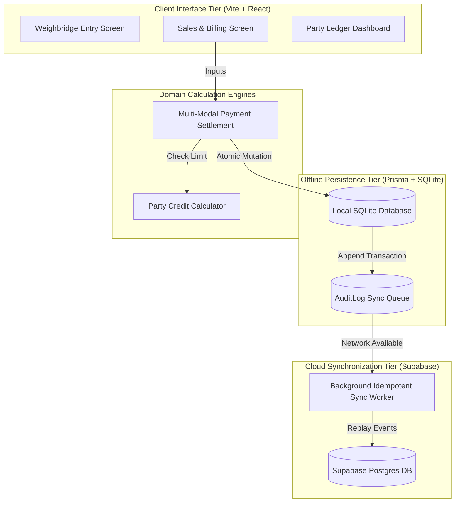

# Comprehensive Master Synthesis: Human Developer & Vibe Coder Infrastructure, Workflows, and Tooling Guide

> **Document Source**: `AI Coding Workflow Implementation Plan (1).pdf`  
> **Target System**: MBM Quarry Enterprise ERP (`MBM1`) & Autonomous AI Engineering Pipelines  
> **Author / Role**: Master Document Review Synthesizer (Report Aggregation & Architectural Synthesis)  
> **Date**: August 18, 2026  
> **Status**: Approved Implementation Master Reference  

---

## Table of Contents

1. [Executive Summary & The Architectural Paradigm Shift](#executive-summary--the-architectural-paradigm-shift)
2. [Category 1: UI / UX Tools, Visual Whiteboarding & "Markdown RAM"](#category-1-ui--ux-tools-visual-whiteboarding--markdown-ram)
   - 1.1 The Concept of "Markdown RAM" & Spatial Grounding
   - 1.2 Strict Mermaid Formatting Constraints (`.cursorrules`)
   - 1.3 Subgraph Architectural Perimeters & Whiteboard Interoperability (Whimsical & tldraw)
   - 1.4 IDE Markdown Previews, GitHub Native Rendering & Obsidian Knowledge Vaults
   - 1.5 Personal ROI for the Human Developer
3. [Category 2: Developer Environment, Compute Arbitrage & Proxy Infrastructure](#category-2-developer-environment-compute-arbitrage--proxy-infrastructure)
   - 2.1 The Token Economics of Multi-Turn Coding (Nominal vs. Effective Multipliers)
   - 2.2 Compute Arbitrage & Promotional Vectors (Reliance Jio AI Pro & Secondary Tiers)
   - 2.3 Local API Key Rotator Proxies Architecture (`gemini-proxy`, `geminiproxy`, `gemini-api-key-rotator`, `gemini-poise`, `ccx`)
   - 2.4 Unified Local Gateway Topology (`http://localhost:8000/v1`) & Client IDEs (Cursor, Claude Code, SillyTavern, Aider, Antigravity)
   - 2.5 Parallel Agentic Scaling via Git Worktrees
   - 2.6 Personal ROI for the Human Developer
4. [Category 3: Codebase Indexing & AST Software Knowledge Graphs (SKGs)](#category-3-codebase-indexing--ast-software-knowledge-graphs-skgs)
   - 3.1 The Failure of Naive Vector RAG for Source Code
   - 3.2 Graphify: Tree-Sitter AST Parsing, PreToolUse Intercept Hooks & Leiden Community Detection
   - 3.3 CODENS: Temporal Git PR Knowledge Graphs & Neo4j Cypher Traversal
   - 3.4 Hardware-Level Context Compression: TurboQuant (PolarQuant & 1-Bit QJL Residual Transform)
   - 3.5 Personal ROI for the Human Developer
5. [Category 4: Specification-Driven Development (SDD) & Task Contracting](#category-4-specification-driven-development-sdd--task-contracting)
   - 4.1 Specification as the Single Source of Truth; Code as a Disposable Derivative
   - 4.2 Decoupled Documentation Hierarchy (`docs/specification/`, `docs/domain/glossary.md`, `docs/decisions/` ADRs)
   - 4.3 The 9-Part Standard Task Contract Template
   - 4.4 Bounded Single-Task Workflow (`Inspect -> Plan -> Edit -> Test -> Audit -> Stop`)
   - 4.5 Defending Against Long-Horizon Degradation (The SlopCodeBench Findings)
   - 4.6 Personal ROI for the Human Developer
6. [Category 5: Automated Quality Gates, Static Analysis & Deterministic Checks](#category-5-automated-quality-gates-static-analysis--deterministic-checks)
   - 5.1 Static Analysis Ownership: ESLint, Prettier, Strict TSConfig & Prisma Validation
   - 5.2 The 12-Layer Verification Pipeline (TypeScript to Sync Queue Tests)
   - 5.3 TDFlow: Test-Driven Development as the Agent's Mathematical Loss Function
   - 5.4 SWE-CI Regression Test Suites & Pre/Post Task Baselines
   - 5.5 Machine-Verifiable Evidence Logging: Eliminating Message-Code Inconsistency
   - 5.6 Personal ROI for the Human Developer
7. [Category 6: Monorepo Architecture, Secrets & Environment Hygiene](#category-6-monorepo-architecture-secrets--environment-hygiene)
   - 7.1 Turborepo Orchestration & Unified Execution (`bun dev`)
   - 7.2 Zero-Trust Secrets Management (Infisical, Doppler & Single `.env` Source of Truth)
   - 7.3 Fail-Fast Runtime Environment Validation via `zod-env`
   - 7.4 Enterprise Variable Naming Standards & Lexical Scope Isolation (The "Rule of Two")
   - 7.5 Personal ROI for the Human Developer
8. [Category 7: The Human Vibe Coder Workflow & Operating Model](#category-7-the-human-vibe-coder-workflow--operating-model)
   - 8.1 Empirical Cognitive Foundations: Iterative Goal Satisfaction & Material Disengagement
   - 8.2 The 3-Tier Memory Architecture (Project Truth, Operating Memory, Task Memory)
   - 8.3 The 5-Stage Human-in-the-Loop Control Loop
   - 8.4 Context File Auditing: Diagnosing & Purging the 6 Configuration Smells
   - 8.5 What the Vibe Coder Outsources vs. The 6 Non-Negotiable Human Responsibilities
9. [Master Tool & Workflow Matrix for the Human Developer](#master-tool--workflow-matrix-for-the-human-developer)
10. [Sequential Implementation Roadmap for MBM Quarry ERP](#sequential-implementation-roadmap-for-mbm-quarry-erp)

---

## Executive Summary & The Architectural Paradigm Shift

Building enterprise software—such as the **MBM Quarry ERP** (`MBM1`)—using autonomous and semi-autonomous AI coding models introduces a well-documented trajectory of early productivity followed by exponential architectural degradation. When developers rely on conversational "pure vibe coding" characterized by sprawling prompts, implicit trust in agent narrative summaries, and reactive debugging, systems reliably suffer from **architectural drift**, **duplicated helper libraries**, **inconsistent naming semantics**, **broken offline sync queues**, **unvalidated schema modifications**, and **rotting documentation**.

The core thesis synthesized from the 2025–2026 empirical software engineering literature is definitive:

> **"Do not attempt to improve AI coding by writing larger, more desperate prompts. Build an unambiguous, deterministic engineering harness around the agent."**

High-velocity AI software engineering is achieved by treating **specifications and deterministic verification gates as the permanent source of truth**, while treating **generated code as a transient, continuously verified derivative artifact**.

```
                           THE CLOSED-LOOP ENGINEERING HARNESS
  ┌──────────────────────────────────────────────────────────────────────────────────┐
  │ 1. FORMAL SPECIFICATION                                                          │
  │    Authoritative contracts in `docs/specification/`, `docs/domain/glossary.md`   │
  └────────────────────────────────────────┬─────────────────────────────────────────┘
                                           │
                                           ▼
  ┌──────────────────────────────────────────────────────────────────────────────────┐
  │ 2. BOUNDED TASK CONTRACT                                                         │
  │    Objective, Scope, Forbidden Changes, Verification Commands, Stop Condition    │
  └────────────────────────────────────────┬─────────────────────────────────────────┘
                                           │
                                           ▼
  ┌──────────────────────────────────────────────────────────────────────────────────┐
  │ 3. CONSTRAINED IMPLEMENTATION (AI Agent)                                         │
  │    Single bounded task; localized edits; zero unsolicited refactoring            │
  └────────────────────────────────────────┬─────────────────────────────────────────┘
                                           │
                                           ▼
  ┌──────────────────────────────────────────────────────────────────────────────────┐
  │ 4. AUTOMATED DETERMINISTIC GATES (12-Layer Verification Pipeline)                │
  │    `tsc --noEmit`, ESLint, Prettier, Prisma Validate, Vitest, Playwright, Build  │
  └────────────────────────────────────────┬─────────────────────────────────────────┘
                                           │
                                           ▼
  ┌──────────────────────────────────────────────────────────────────────────────────┐
  │ 5. INDEPENDENT ADVERSARIAL AUDIT (Dual-Agent Review)                             │
  │    Fresh LLM context reviews raw `git diff` against Task Contract & ADR bounds   │
  └────────────────────────────────────────┬─────────────────────────────────────────┘
                                           │
                                           ▼
  ┌──────────────────────────────────────────────────────────────────────────────────┐
  │ 6. HUMAN ARCHITECTURAL APPROVAL & SOURCE-OF-TRUTH SYNC                           │
  │    Human reviews machine evidence log, signs off on ADRs, syncs documentation    │
  └──────────────────────────────────────────────────────────────────────────────────┘
```

By partitioning developer operations into **Part 1 (Habitual Agent Context & Task Contracting)** and **Part 2 (Deterministic Tooling, Compute Infrastructure & Quality Gates)**, the human developer transitions from low-level syntax typist to high-leverage **System Architect, Intent Director, and Quality Judge**.

---

## Category 1: UI / UX Tools, Visual Whiteboarding & "Markdown RAM"

```
                              VISUAL "MARKDOWN RAM" ECOSYSTEM
                                 `docs/architecture/RAM.md`
                                             │
               ┌─────────────────────────────┼─────────────────────────────┐
               ▼                             ▼                             ▼
     [IDE Markdown Preview]       [GitHub Native PR Render]     [Obsidian Knowledge Vault]
     Live sidebar rendering       Visual architectural diffs    Bi-directional graph linking
     during coding sessions       during dual-agent review      and long-term system PKM
               │                             │                             │
               └─────────────────────────────┼─────────────────────────────┘
                                             ▼
                             [Interactive Digital Whiteboards]
                                   (Whimsical / tldraw)
                             Direct ingestion of Mermaid subgraphs
                             into draggable, interactive nodes
```

### 1.1 The Concept of "Markdown RAM" & Spatial Grounding

A foundational failure mode in extended multi-turn AI coding is **spatial and architectural disorientation**. As conversational context expands over dozens of turns, LLMs experience "attention drift" and lose track of cross-service relationships, data flow hierarchies, and module boundaries.

Expert vibe coders resolve this by maintaining an `architecture.md` (or `RAM.md`) file containing structured Mermaid diagrams. This acts as **"Markdown RAM"**—a compact, visually renderable, persistent representation of system architecture that the AI agent re-reads before planning and updates after completing any structural modification.

### 1.2 Strict Mermaid Formatting Constraints (`.cursorrules`)

To ensure Mermaid diagrams render deterministically across all client preview panes, web viewers, and Markdown parsers without triggering syntax crashes or consuming excessive tokens, strict `.cursorrules` are enforced:

```markdown
# .cursorrules — Mermaid Architecture & Mindmap Standards

1. Orientation Standard:
   - Always default to `graph TD` (Top-Down) layouts.
   - Rationale: Vertical orientation fits naturally in narrow IDE sidebar preview panes (Cursor/VS Code) without horizontal scroll clipping.

2. Node ID Sanitization:
   - Mandate strict alphanumeric IDs without spaces (e.g., `salesLedger`, `syncQueueWorker`).
   - Labels with spaces, punctuation, or special characters MUST be encapsulated in quotes within brackets: `nodeA["Calculate Remaining Credit"]`.
   - Rationale: Unquoted spaces in node IDs trigger immediate syntax errors in standard Mermaid parsers.

3. Spatial Hierarchy & Mindmaps:
   - Enforce pure indentation-based hierarchy for mindmaps.
   - Prohibit external custom icon syntaxes (e.g., `::icon(fa fa-database)`).
   - Rationale: GitHub's native parser rejects external font-awesome injections.

4. Zero Inline Styling / CSS:
   - STRICTLY PROHIBIT inline `style`, `classDef`, or custom CSS rules.
   - Rationale: IDE and Obsidian themes dynamically manage dark/light modes; custom CSS bloats context token consumption and frequently results in unreadable contrast.

5. Subgraph Architectural Boundaries:
   - Group modules within explicit `subgraph <Name>` and `end` blocks to delineate trust boundaries, network splits, and service tiers.
```

### 1.3 Subgraph Architectural Perimeters & Whiteboard Interoperability (Whimsical & tldraw)

Mermaid `subgraph` syntax provides structural perimeters that delineate architectural tiers (e.g., Client UI, Local SQLite Database, Offline Sync Worker, Cloud Backend).



**Bi-Directional Whiteboard Interoperability**:
Modern digital canvas tools—specifically **Whimsical** and **tldraw**—feature native parsers that ingest Mermaid code containing `subgraph` blocks. The whiteboard compiler translates text blocks into editable, draggable geometric visual nodes. The human developer can visually brainstorm or reorganize system modules on an infinite canvas, export the modified layout as Mermaid Markdown, and commit it directly to `docs/architecture/` for the AI to ingest.

### 1.4 IDE Markdown Previews, GitHub Native Rendering & Obsidian Knowledge Vaults

- **IDE Markdown Preview Panes (Cursor / VS Code)**: Provides real-time visual feedback in a docked split pane. As the AI or human updates `RAM.md`, the architecture updates live, allowing the human to visually catch broken relationships or unexpected module couplings.
- **GitHub Native Mermaid Rendering**: GitHub natively parses Mermaid diagrams in Pull Requests and Markdown files. During automated dual-agent review, the reviewer agent and human lead can inspect visual architecture deltas in the PR description without cloning the branch.
- **Obsidian PKM Integration**: For long-term system architecture and project personal knowledge management (PKM), Obsidian indexes `docs/` and renders interactive node-link knowledge graphs, linking architectural decision records (ADRs) to corresponding Mermaid module diagrams.

### 1.5 Personal ROI for the Human Developer

1. **Instant Spatial Intuition**: The developer grasps complex multi-tier dependencies (e.g., how Weighbridge logs propagate to Party Credit) in a 2-second visual glance rather than reading 400 lines of route definitions.
2. **Zero Mental Context Rot**: Returning to a complex feature after days away requires only glancing at `RAM.md` to achieve full mental reorientation.
3. **Flawless AI Context Alignment**: The AI agent operates from the exact same visual structural topology as the human, preventing cross-module hallucination.

---

## Category 2: Developer Environment, Compute Arbitrage & Proxy Infrastructure

```
┌────────────────────────────────────────────────────────────────────────────────────────┐
│                          LOCAL DEVELOPER MACHINE (LOCALHOST)                           │
│                                                                                        │
│   ┌──────────────┐   ┌──────────────┐   ┌──────────────┐   ┌───────────────────────┐   │
│   │    Cursor    │   │ Claude Code  │   │    Aider     │   │ Antigravity / SillyT. │   │
│   └──────┬───────┘   └──────┬───────┘   └──────┬───────┘   └───────────┬───────────┘   │
│          │                  │                  │                       │               │
│          └──────────────────┼──────────────────┴───────────────────────┘               │
│                             │ OpenAI Protocol (`http://localhost:8000/v1`)             │
│                             ▼                                                          │
│   ┌────────────────────────────────────────────────────────────────────────────────┐   │
│   │             DOCKERIZED LOCAL KEY ROTATOR PROXY GATEWAY                         │   │
│   │  • gemini-proxy / gemini-poise / gemini-api-key-rotator / geminiproxy / ccx    │   │
│   │  • Redis Token Bucket Rate Limiting (Capacity C, Refill r)                     │   │
│   │  • Exponential 429 Cooldown State Machine: t_cooldown = t_base * 2^(failures)  │   │
│   │  • OpenAI-to-Gemini Payload & SSE Stream Translation                           │   │
│   └─────────────────────────┬──────────────────────────────────────────────────────┘   │
│                             │                                                          │
└─────────────────────────────┼──────────────────────────────────────────────────────────┘
                              │ Multiplexed Outbound HTTPS Requests
                              ▼
        ┌────────────────────────────────────────────────────────────┐
        │       POOLED PROMOTIONAL / ENTERPRISE COMPUTE ACCOUNTS     │
        │  • Reliance Jio AI Pro (5x SIMs -> 5,000 credits/mo, 5TB)  │
        │  • Google Gemini 3 Pro Frontier API Keys                   │
        │  • Secondary Promotional Tiers (Qwen 3.8-Max 70M Tokens)   │
        └────────────────────────────────────────────────────────────┘
```

### 2.1 The Token Economics of Multi-Turn Coding (Nominal vs. Effective Multipliers)

Autonomous coding environments re-ingest repository context, AST graphs, test logs, and conversational memory on every turn. In deep reasoning loops, context window expansion causes rapid token depletion.

A critical economic trap is the distinction between **advertised nominal token quotas** and **effective usable tokens**. Providers apply computational **Model Multipliers**:

$$\text{Effective Token Allowance} = \frac{\text{Nominal Quota}}{\text{Model Multiplier}}$$

| Model Tier | Representative Model | Multiplier | Headline Daily Quota | Effective Usable Tokens | Multi-Turn Usability |
| :--- | :--- | :---: | :---: | :---: | :--- |
| **Baseline Lightweight** | Claude 3.5 Haiku / Gemini Flash | **1x** | 7,000,000 | **7,000,000** | High volume, routine syntax |
| **Frontier Reasoning** | Claude Opus 4.6 | **4x** | 7,000,000 | **1,750,000** | 75% quota reduction; rapid exhaustion |
| **Ultra Frontier** | GPT-5.6 Sol / Gemini 3 Pro (Deep) | **5x** | 7,000,000 | **1,400,000** | 80% quota reduction; burns in 10–15 turns |

*The Mathematical Reality*: An agent passing 100,000 tokens of project context across a 15-turn refactoring session consumes $1.5\text{M}$ nominal tokens at 1x. Under a 4x multiplier (Claude Opus 4.6), this equals $6.0\text{M}$ nominal tokens—completely consuming an entire daily quota in a single debugging run. This necessitates compute pooling and local proxy infrastructure.

### 2.2 Compute Arbitrage & Promotional Vectors (Reliance Jio AI Pro & Secondary Tiers)

To sustain infinite-compute local development without exorbitant cloud API bills:
- **Reliance Jio AI Pro (India)**:
  - **Eligibility**: Activated via Reliance Jio 5G plans (₹349/month per SIM).
  - **Promotional Provision**: **18 months of complimentary Google One AI Pro** (commercial value: ~₹35,100 / ~$420 USD).
  - **Assets**: Direct access to **Gemini 3 Pro**, **1,000 advanced monthly AI credits**, and **5 TB Google One storage**.
  - **Multi-Account Quota Multiplexing**: Linking multiple family/dual SIMs across 5 separate Google accounts yields **5,000 advanced credits/month** and pooled rate limits.
  - **ToS Risk Warning**: The implementation plan explicitly highlights that while individual accounts are legitimate, pooling quotas through automated rotators is a **Terms of Service gray area**. Developers must manage rate cooling to prevent provider IP blacklisting or account suspension.
- **Secondary Promotional Tiers**: Ingesting high-throughput promotional allocations such as **Alibaba Cloud Qwen 3.8-Max** (70M+ token grants).

### 2.3 Local API Key Rotator Proxies Architecture

To unify disparate keys into a single resilient stream, developers deploy specialized open-source reverse proxy engines locally:

| Proxy Engine & Author | Architecture | Rotation & Cooldown Mechanics | Differentiators & Advanced Features | Developer Superpower Unlocked |
| :--- | :--- | :--- | :--- | :--- |
| **`gemini-proxy`**<br>*(lehuygiang28)* | Node.js / Next.js<br>(Fullstack / Serverless) | Round-robin rotation with exponential backoff on HTTP 429 errors. | • Web dashboard UI<br>• Per-key usage telemetry<br>• Cloudflare Workers edge deploy | Visual monitoring of API key health and quota burn rates. |
| **`geminiproxy`**<br>*(ChakshuGautam)* | Go (Golang)<br>(Compiled Daemon) | Atomic counter sequential round-robin reading from `gemini.keys`. | • Ultra-low CPU/RAM footprint<br>• Dockerized zero-config daemon<br>• Native `go-genai` compatibility | Headless, ultra-fast background proxy for resource-constrained laptops. |
| **`gemini-api-key-rotator`**<br>*(jwadow)* | Python (FastAPI)<br>(Asynchronous REST) | Exponential state machine:<br>$t_{\text{cool}} = t_{\text{base}} \times 2^{\text{failures}}$ | • Dual Gemini + OpenAI endpoints<br>• HTTP/SOCKS5 upstream proxy routing<br>• Zero-latency SSE streaming | Masks local developer IP address and handles live SSE token streaming seamlessly. |
| **`gemini-poise`**<br>*(alterem)* | Python (FastAPI) + React + Redis | **Token Bucket Algorithm** regulating burst capacity ($C$) and refill rate ($r$) across priority queues. | • Redis `SCAN` cursor optimization<br>• Priority tiers (Refactoring vs. Scaffolding)<br>• Multi-tenant API gateway | Allocates fresh high-quota keys to critical architectural tasks while routing docs to low tiers. |
| **`ccx`**<br>*(BenedictKing)* | Multi-Provider Protocol Bridge | Standardized OpenAI `/v1/chat/completions` translation across Claude, OpenAI, and Gemini. | • Cross-provider fallbacks<br>• Vendor payload abstraction | Hot-swap underlying LLMs without modifying IDE settings. |

### 2.4 Unified Local Gateway Topology (`http://localhost:8000/v1`) & Client IDEs

By hosting the proxy inside a local Docker container mapped to `http://localhost:8000`, the developer connects any standard IDE or terminal agent seamlessly:
- **Cursor**: Configured with Custom OpenAI Base URL: `http://localhost:8000/v1`.
- **Claude Code**: Configured via local proxy translation flags.
- **Aider**: CLI initialized with `--openai-api-base http://127.0.0.1:8000/v1`.
- **Antigravity / SillyTavern**: Outbound agent requests routed directly through local multiplexed ports.

### 2.5 Parallel Agentic Scaling via Git Worktrees

Per citation *Scaling My Development with Git Worktrees and Agentic Workflows* (Max Lang):
- **Command**: `git worktree add ../mbm-feature-sales feature/sales-settlement`
- **Developer Impact**: Allows multiple isolated branches of the same git repository to be checked out simultaneously into separate local folders. The developer can launch **Agent A (Cursor)** in Directory 1 working on Sales Settlement while **Agent B (Claude Code)** in Directory 2 works on Offline Sync Replay—with zero branch-switching overhead, no stash conflicts, and no dirty workspace collisions.

### 2.6 Personal ROI for the Human Developer

1. **Perception of Infinite Compute**: The human vibe coder experiences continuous, high-throughput LLM streaming without hitting 429 HTTP rate limit walls.
2. **Total Cost Elimination**: Leverages promotional tiers and arbitrage to achieve enterprise-tier frontier intelligence at near-zero marginal expense.
3. **Unbroken Flow State**: Eliminates the cognitive disruption of manually generating, swapping, or debugging API keys midway through a complex refactoring loop.

---

## Category 3: Codebase Indexing & AST Software Knowledge Graphs (SKGs)

```
                            SOFTWARE KNOWLEDGE GRAPH (SKG) PIPELINE
                                   (Graphify & Tree-Sitter)
                                              │
               ┌──────────────────────────────┴──────────────────────────────┐
               ▼                                                             ▼
     [Static Source Code]                                          [Temporal PR History]
     TypeScript, Prisma, SQL, Docs                                 Git Commits, PR Diffs, ADRs
               │                                                             │
               ▼                                                             ▼
     [Tree-Sitter AST Parser]                                      [CODENS Temporal Engine]
     Deterministic Extraction (40+ Langs)                          LLM-Extracted Semantic Deltas
               │                                                             │
               ▼                                                             ▼
       `graph.json`                                                [Neo4j Graph Database]
     • Calls, Imports, Inherits (`EXTRACTED`)                      Queryable via Cypher
     • Inline Rationale & Hacks (`INFERRED`)                       (`GET_NODE`, `GET_NEIGHBORS`)
               │                                                             │
               └──────────────────────────────┬──────────────────────────────┘
                                              ▼
                             [PreToolUse IDE Intercept Hook]
                             Intercepts raw file searches; routes
                             queries through structural graph
                                              │
               ┌──────────────────────────────┴──────────────────────────────┐
               ▼                                                             ▼
     `graphify path A B`                                           Leiden Community Detection
     Instant shortest dependency path                              Identifies "God Node" bottlenecks
```

### 3.1 The Failure of Naive Vector RAG for Source Code

Standard Retrieval-Augmented Generation (RAG) relies on probabilistic text embeddings. Source code, however, is governed by deterministic structural hierarchies (Abstract Syntax Trees, class inheritance, import trees, lexical scopes). 

Probabilistic vector search frequently fails because:
- It cannot distinguish identically named functions across different boundaries (e.g., `formatDate()` in client UI vs. `formatDate()` in database serialization).
- It cannot trace transitive call chains across 5 files.
- It returns high-similarity text snippets while omitting the critical interface contract defined in an adjacent file.

### 3.2 Graphify: Tree-Sitter AST Parsing, PreToolUse Intercept Hooks & Leiden Community Detection

**Graphify** (Graphify Labs) builds a deterministic Software Knowledge Graph (SKG) directly from repository ASTs:
1. **Tree-Sitter Parsing**: Parses 40+ programming languages into a lightweight `graph.json`.
2. **Confidence Dual-Tagging**:
   - `EXTRACTED`: Hard mathematical facts (e.g., `SaleComponent` *imports* `calculatePartyCredit`, `Party` *has_many* `Sales`).
   - `INFERRED`: Contextual knowledge extracted from code comments (`// NOTE:`, `// HACK:`) and architectural documents.
3. **IDE PreToolUse Intercept Hook**: Installed via `graphify install`. When an agent attempts an exploratory string grep across the codebase, the hook intercepts the call and queries `graph.json`, reducing exploration token burn by up to **71.5x**.
4. **Structural Analysis Commands**:
   - `graphify path A B`: Instantly computes the exact dependency chain between two disparate modules.
   - **Leiden Community Detection**: Mathematically pinpoints architectural **"God Nodes"** (modules with disproportionately high centrality), warning the developer before the AI attempts high-risk refactoring on core bottlenecks.

### 3.3 CODENS: Temporal Git PR Knowledge Graphs & Neo4j Cypher Traversal

Per arXiv:2607.18356 (*CODENS: Transforming Code Changes into Living, Accessible, and Queryable Documentation*):
- **Mechanics**: CODENS processes the chronological Git history of the repository. For every Pull Request, it feeds the diff and prior node state into an LLM to generate semantic node updates, persisting the evolving graph into a **Neo4j graph database**.
- **Queryable Graph Interface**: Exposes agent tools: `GET_NODE`, `GET_NEIGHBORS`, and `CYPHER`.
- **Developer Impact**: Instantly answers historical **"Why"** questions. When a vibe coder asks why offline sync handles conflicts using Last-Write-Wins instead of CRDTs, CODENS queries Neo4j to retrieve the exact architectural debate and PR rationale from 4 months prior.

### 3.4 Hardware-Level Context Compression: TurboQuant (PolarQuant & 1-Bit QJL Residual Transform)

Developed by Google Research and DeepMind (Zandieh et al., 2025), **TurboQuant** resolves Key-Value (KV) cache memory bottlenecks in long-context models:

```
Input High-Dimensional KV Vectors
             │
             ▼
┌────────────────────────────────────────────────────────────┐
│ STAGE 1: PolarQuant (Optimal Angle Quantization)           │
│ • Applies random orthogonal rotation in Euclidean space    │
│ • Maps coordinates to Polar coordinate system              │
│ • Recursively compresses angles via Lloyd-Max quantization │
│ • Eliminates per-block full-precision normalization        │
└────────────────────────────┬───────────────────────────────┘
                             │ Residual Error Vector
                             ▼
┌────────────────────────────────────────────────────────────┐
│ STAGE 2: 1-Bit QJL Transform (Residual Error Correction)   │
│ • Quantized Johnson-Lindenstrauss (QJL) error projection   │
│ • Stores 1-bit sign vector of the residual difference      │
│ • Mathematical debiasing for inner-product estimation      │
└────────────────────────────┬───────────────────────────────┘
                             │
                             ▼
  6x Compression (3–3.5 bits/val) | 8x Faster Computation | Zero Accuracy Loss
```

- **Performance**: Delivers up to an **8x speedup** in attention-logit computation on Nvidia H100 GPUs and compresses the KV cache down to **3–3.5 bits per value** (a **6x compression ratio**).
- **Zero Loss Verification**: Maintains 100% retrieval accuracy on LongBench and Needle In A Haystack benchmarks from 4,000 up to 104,000 tokens.

### 3.5 Personal ROI for the Human Developer

1. **Ingest Massive Repositories Without Latency**: TurboQuant allows feeding complete database schemas, comprehensive business rules, and PR histories into model context with zero Time-to-First-Token (TTFT) lag.
2. **Instant Impact Analysis**: Graphify reveals the exact blast radius of a schema change across all UI components and API routes before any code is modified.
3. **Living Architectural Memory**: CODENS eliminates undocumented legacy code mysteries by making git history semantically queryable.

---

## Category 4: Specification-Driven Development (SDD) & Task Contracting

```
                    SPECIFICATION-DRIVEN DEVELOPMENT (SDD)
┌─────────────────────────────────────────────────────────────────────────────┐
│                    STRUCTURED SPECIFICATION (SOURCE OF TRUTH)               │
│  • docs/specification/business-rules.md     • docs/domain/glossary.md       │
│  • docs/specification/data-model.md         • docs/decisions/ADR-*.md       │
└──────────────────────────────────────┬──────────────────────────────────────┘
                                       │
                                       ▼
┌─────────────────────────────────────────────────────────────────────────────┐
│                       BOUNDED TASK CONTRACT (PROMPT HARNESS)                │
│  1. Objective           4. Architecture     7. Acceptance Criteria          │
│  2. Scope (Files)       5. Required Behavior 8. Verification Command        │
│  3. Source of Truth     6. Forbidden Changes 9. Stop Condition              │
└──────────────────────────────────────┬──────────────────────────────────────┘
                                       │
                                       ▼
┌─────────────────────────────────────────────────────────────────────────────┐
│                         6-STEP BOUNDED EXECUTION LOOP                       │
│  INSPECT  ──►  PLAN  ──►  EDIT  ──►  TEST  ──►  AUDIT  ──►  STOP & FLUSH   │
└──────────────────────────────────────┬──────────────────────────────────────┘
                                       │
                                       ▼
┌─────────────────────────────────────────────────────────────────────────────┐
│                      TRANSIENT DERIVATIVE ARTIFACT (CODE)                   │
│  • TypeScript Code     • SQLite Migrations    • UI Components               │
│  (Compiled, Verified, and Replaced without Emotional Attachment)            │
└─────────────────────────────────────────────────────────────────────────────┘
```

### 4.1 Specification as the Single Source of Truth; Code as a Disposable Derivative

Per *Specification-Driven Development as the Foundation of AI-Native Enterprise Software Engineering* (arXiv:2607.16680, July 2026):
- **Human Creative Labor Lives in Specifications**: The human developer's primary job is authoring, refining, and maintaining structured markdown specifications.
- **Code is a Transient Derivative**: Generated TypeScript, SQL migrations, and UI code are treated as disposable artifacts compiled from specifications and verified by automated test harnesses.

### 4.2 Decoupled Documentation Hierarchy

To eliminate monolithic context bloat, project knowledge is partitioned into dedicated modular files:

```
docs/
├── specification/
│   ├── business-rules.md             # Invariant formulas, financial calculations, credit logic
│   ├── functional-requirements.md    # Feature requirements and user interaction flows
│   ├── non-functional-requirements.md# Offline sync latency, local SQLite performance SLAs
│   ├── architecture-contract.md      # UI -> Service -> Local DB -> SyncQueue boundaries
│   ├── data-model-contract.md        # Prisma schema invariants, relation mapping rules
│   └── integration-contracts.md      # Supabase sync payloads and webhook schemas
│
├── domain/
│   ├── glossary.md                   # Ubiquitous domain language (Party, Material, Boulder)
│   ├── entities.md                   # Entity lifecycles and valid state transitions
│   └── workflows.md                  # Weighbridge sales flow, purchase order workflows
│
├── decisions/
│   ├── ADR-001-offline-first.md      # Local SQLite first, background Supabase sync
│   ├── ADR-002-sync-model.md         # AuditLog event replay and conflict resolution
│   └── ADR-003-financial-ledger.md   # Double-entry ledger invariants for party credit
│
└── tasks/
    └── TASK-XXX-feature-name.md      # Active bounded task contracts
```

#### Concrete MBM Domain Contract Example:
```markdown
### Sales Settlement & Credit Allocation Contract
1. Calculation: `GrossAmount = QuantityInTons * RatePerTon`
2. Payment Split: `TotalPaid = CashAmount + BankTransferAmount + GPayAmount`
3. Credit Invariant: `RemainingCreditAddition = GrossAmount - TotalPaid`
4. Hard Policy: If `Party.CreditStatus == 'BLOCKED'` and `TotalPaid < GrossAmount`, REJECT TRANSACTION.
5. Accounting Invariant: Every completed sale creates 1 `SaleRecord`, N `PaymentRecords`, and 1 `LedgerEntry`.
```

### 4.3 The 9-Part Standard Task Contract Template

Every assignment dispatched to an AI agent is formalized in an unyielding contract:

```markdown
# TASK CONTRACT: [TASK-ID] - [Task Title]

## 1. Objective
Concise 1-2 sentence description of the exact feature or fix to implement.

## 2. Scope
Strict, exhaustive list of file paths permitted to be created or modified.

## 3. Relevant Source-of-Truth Files
- `docs/specification/business-rules.md#sales-settlement`
- `docs/domain/glossary.md`
- `prisma/schema.prisma`

## 4. Existing Architecture
Brief summary of current data flow and structural patterns that MUST be preserved.

## 5. Required Behavior
Bullet-pointed operational specifications, mathematical formulas, and state transitions.

## 6. Forbidden Changes (Strict Guardrails)
- DO NOT modify `prisma/schema.prisma` without explicit permission.
- DO NOT add external npm dependencies.
- DO NOT bypass the local SQLite `AuditLog` sync queue.
- DO NOT alter public signatures of existing core calculation functions.

## 7. Acceptance Criteria
1. Criterion 1 (e.g., Validates split payment sum against gross total).
2. Criterion 2 (e.g., Throws `CreditLimitExceededError` when party limit is breached).

## 8. Verification Commands (Deterministic Proof)
- `npm run typecheck`
- `npm run lint`
- `npx vitest run tests/unit/sales/settlement.test.ts`
- `npm run build`

## 9. Stop Condition
When verification commands pass with Exit Code 0, generate the Machine Evidence Log and HALT. Do not perform unrequested refactoring.
```

### 4.4 Bounded Single-Task Workflow (`Inspect -> Plan -> Edit -> Test -> Audit -> Stop`)

The developer enforces a 6-step bounded execution lifecycle:
1. **INSPECT**: Agent reads the Task Contract and designated Source-of-Truth files.
2. **PLAN**: Agent outputs a concise execution plan (files to touch, test assertions).
3. **EDIT**: Agent performs minimal, localized code edits within the assigned Scope.
4. **TEST**: Agent executes deterministic verification commands.
5. **AUDIT**: Agent checks output against Forbidden Changes and lint rules.
6. **STOP & FLUSH**: Agent halts immediately upon test pass; the developer commits the change and **flushes agent context memory** before starting the next task.

### 4.5 Defending Against Long-Horizon Degradation (The SlopCodeBench Findings)

Per *SlopCodeBench* (arXiv:2603.24755, March 2026), evaluating 11 frontier LLMs over iterative software engineering tasks:
- **89.8% of multi-task trajectories suffered severe verbosity growth** (dead code, duplicated helpers).
- **80.0% of trajectories exhibited structural erosion** (broken abstraction layers, leaky state).
- **Zero out of 11 models completed long-horizon benchmarks without failure.**
- **Prompt engineering alone failed** to prevent compounding architectural decay.

*The Defense*: **Hard Single-Task Context Isolation**. Never chain multiple distinct features into a single continuous conversational thread. Always start a fresh agent session from the clean Task Contract.

### 4.6 Personal ROI for the Human Developer

1. **Elimination of Scope Creep**: The AI is strictly barred from refactoring unrelated modules or introducing rogue dependencies.
2. **Deterministic Predictability**: The developer reviews the Task Contract once, initiates the agent, and knows the agent will halt at the exact completion boundary.
3. **Scalable Micro-Commits**: Every commit represents a clean, fully verified, bisectable unit of work.

---

## Category 5: Automated Quality Gates, Static Analysis & Deterministic Checks

```
                               12-LAYER VERIFICATION GATE PIPELINE
┌────────────────────────────────────────────────────────────────────────────────────────┐
│  Layer 1:  TypeScript Compilation   ──► `tsc --noEmit` (strict null, no implicit any)  │
│  Layer 2:  ESLint Validation        ──► `eslint . --max-warnings=0` (AST linting)      │
│  Layer 3:  Prettier Formatting      ──► `prettier --check .` (aesthetic consistency)   │
│  Layer 4:  Prisma Validation        ──► `prisma validate` (relational integrity)       │
│  Layer 5:  Unit Test Suite          ──► `vitest run tests/unit` (arithmetic & logic)   │
│  Layer 6:  Integration Tests        ──► `vitest run tests/integration` (API & DB)      │
│  Layer 7:  End-to-End (E2E) Tests   ──► `playwright test` (headless user journeys)     │
│  Layer 8:  Production Build Bundler ──► `npm run build` / `bun build` (bundle assets) │
│  Layer 9:  Static Security Scan     ──► `bandit` / `semgrep` (injection, tokens)       │
│  Layer 10: Dependency Vulnerability ──► `npm audit --audit-level=high` (CVE checks)    │
│  Layer 11: DB Migration Validation  ──► `prisma migrate diff` (SQLite ↔ Postgres)      │
│  Layer 12: Offline Sync Queue Tests ──► `vitest run tests/sync` (AuditLog replay)      │
└────────────────────────────────────────────────────────────────────────────────────────┘
```

### 5.1 Static Analysis Ownership: ESLint, Prettier, Strict TSConfig & Prisma Validation

A major discovery from empirical repository analysis (*Configuration Smells in AGENTS.md Files*, arXiv:2606.15828) is that **62% of AI agent configurations suffer from "Lint Leakage"**—the antipattern of writing natural language prompt instructions for rules that linters and compilers enforce automatically.

The solution is strict mechanical separation:
- **Mechanized Linters**: ESLint, Prettier, and TypeScript compiler enforce casing, formatting, import sorting, and type safety with zero token waste.
- **Prisma Schema Validation**: `npx prisma validate` catches foreign key mismatches, missing relations, and schema typos in milliseconds before code generation occurs.

### 5.2 The 12-Layer Verification Pipeline

To ensure absolute enterprise safety, every agent modification must pass through the **12-Layer Verification Gate Pipeline** (detailed in the diagram above). Passing functional unit tests is necessary but insufficient—security, formatting, type completeness, database migration compatibility, and offline sync replay must all be proven deterministically.

### 5.3 TDFlow: Test-Driven Development as the Agent's Mathematical Loss Function

Per *TDFlow: Agentic Workflows for Test Driven Development* (EACL 2026):
- **Benchmark Results**: Achieves **88.8% on SWE-Bench Lite** and **94.3% on SWE-Bench Verified**.
- **Four Specialized Stages**: (1) Patch Proposal, (2) Debugging, (3) Patch Revision, (4) Test Generation.
- **Core Principle**: LLMs have no physical sensory grounding; an agent asked *"Is this correct?"* will almost always reply *"Yes"*. The human developer must provide a **concrete, executable test case** as the agent's mathematical loss function.

```typescript
// tests/unit/sales/settlement.test.ts — Deterministic Loss Function
import { describe, it, expect } from 'vitest';
import { calculateSaleSettlement } from '@/core/sales/settlement';

describe('Sales Settlement Invariant Contract', () => {
  it('correctly splits multi-modal payments and calculates party credit', () => {
    const transaction = {
      grossAmount: 12000,
      cashReceived: 4000,
      bankTransfer: 3000,
      gpayReceived: 1000,
      partyCreditLimit: 20000,
      partyCurrentDebt: 5000,
    };

    const settlement = calculateSaleSettlement(transaction);

    // Deterministic mathematical assertions
    expect(settlement.totalPaid).toBe(8000);
    expect(settlement.remainingCreditAddition).toBe(4000);
    expect(settlement.newPartyDebt).toBe(9000);
    expect(settlement.isApproved).toBe(true);
  });
});
```

### 5.4 SWE-CI Regression Test Suites & Pre/Post Task Baselines

Per *SWE-CI* (arXiv:2603.03823 / SKYLENAGE-AI):
- **Pre-Task Baseline**: Run the full regression test suite **before** dispatching the prompt to record a clean 100% pass baseline.
- **Post-Task Verification**: Run the regression suite **after** agent execution.
- **Delta Comparison**: If any legacy test fails, the task is immediately rejected. This prevents pre-existing bugs from being confused with agent regressions.

### 5.5 Machine-Verifiable Evidence Logging: Eliminating Message-Code Inconsistency

Per *Analyzing Message-Code Inconsistency in AI Coding Agent-Authored PRs* (arXiv:2601.04886):
- **1.7% of agent PRs contain severe Message-Code Inconsistency** (where natural-language claims state a feature works, but the git diff omits the code or uses dummy stubs).
- Inconsistent PRs suffer a **51.7% lower acceptance rate** and take **3.5x longer to resolve**.

*The Rule*: **Never trust conversational assertions. Require raw machine execution evidence tables.**

```markdown
## Machine-Verifiable Evidence Report

### 1. Git Diff Summary (`git status --porcelain`)
- `src/core/sales/settlement.ts` (+38, -6 lines)
- `tests/unit/sales/settlement.test.ts` (+42, -0 lines)
- Unrelated Files Modified: NONE

### 2. Deterministic Verification Gate Table
| Gate | Command Executed | Exit Code | Result | Evidence Output Snippet |
| :--- | :--- | :---: | :---: | :--- |
| **Typecheck** | `npm run typecheck` | `0` | **PASS** | `Found 0 errors across 156 files.` |
| **Linter** | `npm run lint` | `0` | **PASS** | `Zero ESLint warnings.` |
| **Unit Tests** | `npx vitest run tests/unit/` | `0` | **PASS** | `✓ 34 tests passed in 1.4s` |
| **Build** | `npm run build` | `0` | **PASS** | `dist/ ready in 920ms.` |
```

### 5.6 Personal ROI for the Human Developer

1. **Zero Line-by-Line Code Review**: If the evidence table shows all Exit Code `0`s and the git diff matches the scoped files, the developer merges code with complete confidence.
2. **Instant Immunity to LLM Gaslighting**: Eliminates hours lost to chasing hallucinated agent claims or dummy mock stubs.
3. **Rock-Solid Production Deployments**: Multi-layered defense ensures zero runtime crashes in the field.

---

## Category 6: Monorepo Architecture, Secrets & Environment Hygiene

```
                          MONOREPO & SECRETS ARCHITECTURE
                               (Turborepo + Infisical)
                                          │
                  ┌───────────────────────┴───────────────────────┐
                  ▼                                               ▼
     [Infisical / Doppler Cloud]                    [Single Local `.env` (Dev)]
     Centralized secret vault                       Strictly git-ignored;
     Dynamic runtime injection                      Mirrored by `.env.example`
                  │                                               │
                  └───────────────────────┬───────────────────────┘
                                          ▼
                             [Turborepo Orchestration]
                             `turbo.json` / `bun dev`
                                          │
                  ┌───────────────────────┼───────────────────────┐
                  ▼                       ▼                       ▼
            `apps/web`               `apps/api`              `packages/`
           (Frontend UI)            (Backend API)          (Shared Schemas)
                  │                       │                       │
                  └───────────────────────┬───────────────────────┘
                                          ▼
                            [`zod-env` Schema Validation]
                            Fails fast at boot on missing/invalid env
```

### 7.1 Turborepo Orchestration & Unified Execution (`bun dev`)

- **Single Source of Truth (SSOT)**: Consolidates client applications (`apps/web`), backend services (`apps/api`), and shared utilities/contracts (`packages/`) into a unified Turborepo monorepo.
- **Unified Command Pipeline**: A single command (`bun dev` or `turbo run dev`) orchestrates concurrent service builds, hot reloading, and intelligent pipeline caching.
- **Developer Impact**: Edits made to shared domain models or Zod contracts in `packages/` are instantaneously propagated to both frontend and backend sub-apps with zero manual linking.

### 7.2 Zero-Trust Secrets Management (Infisical, Doppler & Single `.env` Source of Truth)

- **The Pragmatic Triage for Solo Developers**:
  - *Current Phase (Single-Tenant ERP)*: Maintain a **Single `.env` Source of Truth** paired with an exhaustive `.env.example` defining every required variable, type, and purpose. Defer enterprise SaaS secret managers (Doppler/Infisical) to avoid premature subscription and CLI overhead.
  - *Multi-Environment Phase*: Deploy **Infisical** or **Doppler** for dynamic runtime secret injection (`infisical run --env=dev -- bun dev`), completely eliminating `.env` files from developer disk.
- **Git Hygiene**: `.env` files are permanently hard-excluded in `.gitignore` to prevent API keys (Supabase service keys, Gemini tokens, JWT secrets) from leaking into agent prompt contexts.

### 7.3 Fail-Fast Runtime Environment Validation via `zod-env`

Every application boots through a strict `zod-env` validation barrier:

```typescript
// config/env.ts — Fail-Fast Environment Validation
import { z } from 'zod';

const envSchema = z.object({
  NODE_ENV: z.enum(['development', 'test', 'production']).default('development'),
  DATABASE_URL: z.string().url(),
  SUPABASE_URL: z.string().url(),
  SUPABASE_SERVICE_ROLE_KEY: z.string().min(20),
  GEMINI_API_KEY: z.string().min(10),
  PORT: z.coerce.number().default(3000),
});

export const env = envSchema.parse(process.env);
```

*Developer Benefit*: Prevents insidious runtime crashes midway through customer workflows. If an environment variable is missing or malformed, the application halts at boot time with a precise, actionable schema error.

### 7.4 Enterprise Variable Naming Standards & Lexical Scope Isolation (The "Rule of Two")

To prevent AI statistical drift during multi-file code generation, the document mandates strict variable naming conventions:

| Standard | Rule & Specification | Concrete Syntax Example | Rationale for AI & Human Developer |
| :--- | :--- | :--- | :--- |
| **Case Consistency** | Strict environment-level casing. | TypeScript: `camelCase` (`partyCredit`, `grossAmount`)<br>React Components: `PascalCase` (`WeighbridgeEntry`) | Prevents the AI from mixing conventions across files and creating broken imports. |
| **Constant Immutability** | All immutable configuration constants use screaming snake case. | `MAX_CREDIT_LIMIT = 50000`<br>`SYNC_RETRY_INTERVAL_MS = 5000` | Programmatically signals to the LLM that this value is a fixed contract that must **never** be reassigned. |
| **Scope Isolation (LEGB)** | Strict Local, Enclosing, Global, Built-in hierarchy; private members prefixed with `_`. | `_cachedSettlementResult`<br>`_validateLedgerBalance()` | Prevents the AI from leaking private helper functions or internal state into public module exports. |
| **Explicit Phrasing** | Descriptive naming; prohibit single-character variables outside loop counters. | Prohibited: `p = calc(x)`<br>Required: `partyRecord = calculateGross(weighbridgeTrip)` | Eliminates semantic ambiguity during multi-turn agent context retention. |

### 7.5 Personal ROI for the Human Developer

1. **Zero Leaked Secrets**: Guarantees sensitive production tokens are never ingested by LLM prompts or committed to git.
2. **Instant Multi-Service Startup**: One command (`bun dev`) boots the entire ERP ecosystem with cached pipelines.
3. **Self-Documenting Codebase**: Enforcing the "Rule of Two" ensures AI-generated code reads cleanly and adheres to strict scoping boundaries.

---

## Category 7: The Human Vibe Coder Workflow & Operating Model

```
                         THE HUMAN VIBE CODER CONTROL LOOP
┌─────────────────────────────────────────────────────────────────────────────────┐
│                               HUMAN INTENT DIRECTOR                             │
│       Defines Business Problem + System Meaning + Architectural Constraints     │
└────────────────────────────────────────┬────────────────────────────────────────┘
                                         │
                                         ▼
┌─────────────────────────────────────────────────────────────────────────────────┐
│                              AI IMPLEMENTATION AGENT                            │
│           Generates Concrete Code Edits within Bounded Task Contract            │
└────────────────────────────────────────┬────────────────────────────────────────┘
                                         │
                                         ▼
┌─────────────────────────────────────────────────────────────────────────────────┐
│                         AUTOMATED DETERMINISTIC CHECKS                          │
│               12-Layer Verification Pipeline (TypeScript to Sync Tests)         │
└────────────────────────────────────────┬────────────────────────────────────────┘
                                         │
                                         ▼
┌─────────────────────────────────────────────────────────────────────────────────┐
│                          INDEPENDENT AI REVIEW AGENT                            │
│       Zero-Memory Reviewer Audits Diff against Specification & ADR Boundaries   │
└────────────────────────────────────────┬────────────────────────────────────────┘
                                         │
                                         ▼
┌─────────────────────────────────────────────────────────────────────────────────┐
│                             HUMAN ARCHITECTURAL JUDGE                           │
│        Reviews Machine Evidence Log, Approves ADRs, Merges Bisectable Commit    │
└─────────────────────────────────────────────────────────────────────────────────┘
```

### 8.1 Empirical Cognitive Foundations: Iterative Goal Satisfaction & Material Disengagement

Grounded in empirical developer research by Advait Sarkar and Ian Drosos (*Vibe coding: programming through conversation with artificial intelligence*, arXiv:2506.23253):
- **Iterative Goal Satisfaction Cycles**: Developers execute rapid tri-phase cognitive loops:
  1. *Conceptual Prompting*: Defining objectives, formulas, and constraints.
  2. *Rapid Output Scanning*: Visually spot-checking diffs and interface signatures rather than reading raw syntax.
  3. *Targeted Application Testing*: Running automated test runners to verify objective mathematical compliance.
- **Material Disengagement**: The developer disengages from the low-level "material" (typing syntax, formatting braces, resolving trivial import paths) to maintain high-level cognitive focus over system boundaries, domain invariants, and security perimeters.

### 8.2 The 3-Tier Memory Architecture

To prevent context saturation and cross-contamination, memory is structured into three formal tiers:

| Memory Tier | File Location | Content & Purpose | Lifespan & Update Frequency |
| :--- | :--- | :--- | :--- |
| **Tier 1: Project Truth** | `docs/specification/`<br>`docs/domain/`<br>`docs/decisions/` | Invariant business rules, data models, glossary, security contracts, ADRs. | Permanent; updated only via verified doc-sync. |
| **Tier 2: Agent Operating Memory** | `AGENTS.md` (Root) | Lean (<100 lines) switchboard: project identity, architecture boundaries, standard commands, progressive disclosure index. | Permanent; audited bi-weekly. |
| **Tier 3: Task Memory** | `docs/tasks/TASK-*.md` | Ephemeral task contract: objective, scoped files, test logs, attempt history. | Transient; active during task, archived upon completion. |
| **Auxiliary: Current State** | `docs/status/current-state.md` | Active migration version, known edge cases, current sprint milestones. | Evolving; updated at milestone completion. |

### 8.3 The 5-Stage Human-in-the-Loop Control Loop

The human developer orchestrates software delivery through a closed 5-stage loop:
1. **Stage 1 (Intent & Specification)**: Human writes domain contracts and acceptance criteria in `docs/`.
2. **Stage 2 (AI Implementation)**: Implementer agent proposes localized diffs inside a bounded task contract.
3. **Stage 3 (Deterministic Tooling)**: 12-layer verification pipeline executes automatically, generating binary pass/fail exit codes.
4. **Stage 4 (Independent AI Review)**: A secondary reviewer agent (fresh context) audits the git diff for architectural violations, message-code inconsistency, and security flaws.
5. **Stage 5 (Human Architectural Approval)**: Human inspects the machine evidence log and signs off on the commit.

### 8.4 Context File Auditing: Diagnosing & Purging the 6 Configuration Smells

Per empirical research on 100 repositories (*Configuration Smells in AGENTS.md Files*, arXiv:2606.15828), 91% of agent context files suffer from severe antipatterns. Every 2–4 weeks, the developer performs a structured context audit:

```
                            THE 6 CONFIGURATION SMELLS AUDIT
  ┌───┐
  │ 1 │ LINT LEAKAGE (62%): Purge formatting/naming rules that ESLint/Prettier already enforce.
  ├───┤
  │ 2 │ CONTEXT BLOAT (42%): Remove full API guides; replace with progressive disclosure pointers.
  ├───┤
  │ 3 │ SKILL LEAKAGE: Eliminate duplicate tool definitions across disparate config files.
  ├───┤
  │ 4 │ CONFLICTING INSTRUCTIONS (28%): Resolve contradictory rules between docs and tooling.
  ├───┤
  │ 5 │ INIT FOSSILIZATION: Prune obsolete Day-1 boilerplate rules that no longer apply.
  ├───┤
  │ 6 │ BLIND REFERENCES: Fix or delete broken paths pointing to renamed or deleted files.
  └───┘
```

### 8.5 What the Vibe Coder Outsources vs. The 6 Non-Negotiable Human Responsibilities

```
┌──────────────────────────────────────────────┬──────────────────────────────────────────────┐
│       WHAT THE VIBE CODER OUTSOURCES         │   THE 6 NON-NEGOTIABLE HUMAN RESPONSIBILITIES│
├──────────────────────────────────────────────┼──────────────────────────────────────────────┤
│ ❌ Writing repetitive TypeScript boilerplate │ 1. Defining System Meaning & Business Logic   │
│ ❌ Manually checking indentation & formatting│ 2. Establishing Architectural Boundaries (ADRs)│
│ ❌ Debugging trivial compiler syntax errors  │ 3. Authoring Domain Contracts & Glossaries   │
│ ❌ Writing boilerplate CRUD queries          │ 4. Designating Single Sources of Truth       │
│ ❌ Manually running browser happy-path tests │ 5. Specifying Concrete Acceptance Criteria   │
│ ❌ Sorting imports and renaming variables    │ 6. Enforcing Verification Policies & Gates   │
└──────────────────────────────────────────────┴──────────────────────────────────────────────┘
```

---

## Master Tool & Workflow Matrix for the Human Developer

The following master matrix synthesizes every tool, integration, proxy, and workflow practice evaluated across the implementation plan, detailing its exact personal benefit to the human developer:

| Category / Domain | Tool / Integration / Practice | Technical Identity & Mechanism | Direct Personal Benefit to the Human Developer |
| :--- | :--- | :--- | :--- |
| **Visual Memory** | **Mermaid "Markdown RAM"** | `architecture.md` with `graph TD`, alphanumeric IDs, and subgraph perimeters. | Prevents AI spatial disorientation; gives human instant visual architecture intuition. |
| **Visual UX** | **Whimsical & tldraw** | Native Mermaid Subgraph ingestion into draggable whiteboard nodes. | Enables visual brainstorming on canvas with direct bi-directional export to Markdown. |
| **Visual PKM** | **Obsidian & IDE Previews** | Live Markdown preview panes and bi-directional graph linking. | Real-time visual feedback during editing; long-term visual knowledge management. |
| **Compute Arbitrage** | **Reliance Jio AI Pro** | ₹349/mo 5G plan unlocking 18 months of free Gemini 3 Pro, 1000 credits/mo, 5TB cloud. | Eliminates LLM API costs; unlocks enterprise-tier frontier compute at near-zero expense. |
| **Key Proxy (Fullstack)**| **`gemini-proxy`** *(lehuygiang)*| Next.js / Cloudflare reverse proxy with round-robin key rotation and 429 retries. | Visual web UI dashboard to monitor key quotas and health; serverless deployment. |
| **Key Proxy (Daemon)** | **`geminiproxy`** *(ChakshuGautam)*| Go compiled binary reading `gemini.keys` via atomic counter round-robin. | Ultra-low CPU/RAM daemon running in background with zero configuration overhead. |
| **Key Proxy (Async)** | **`gemini-api-key-rotator`** *(jwadow)*| Python FastAPI gateway with exponential cooling and SOCKS5 IP routing. | Shields developer IP from rate-limit bans; handles SSE streaming agent responses without lag. |
| **Key Proxy (Enterprise)**| **`gemini-poise`** *(alterem)*| Redis-backed Token Bucket algorithm with priority tiers and `SCAN` cursors. | Prioritizes fresh keys for complex refactoring while routing simple docs to lower tiers. |
| **Key Proxy (Bridge)** | **`ccx`** *(BenedictKing)* | Multi-model translation gateway across Claude, Codex, and Gemini endpoints. | Allows swapping underlying LLM backends on the fly without reconfiguring IDE settings. |
| **Parallel Coding** | **Git Worktrees** | `git worktree add` checking out multiple branches simultaneously. | Runs multiple AI agents (Cursor + Claude Code) in parallel on isolated local branches. |
| **Context Compression** | **TurboQuant** (DeepMind) | PolarQuant angle quantization + 1-bit QJL residual correction (6x compression). | Ingests entire monorepos and schemas without VRAM blowup, TTFT lag, or accuracy loss. |
| **Static Code Graph** | **Graphify** (Graphify Labs) | Tree-sitter AST parsing, PreToolUse IDE hooks, Leiden community detection. | 71.5x token savings during codebase exploration; instantly flags dangerous "God nodes". |
| **Temporal Code Graph** | **CODENS** | Chronological Git PR replay into Neo4j graph database with Cypher query tools. | Answers historical "Why" questions; makes historical architectural rationale queryable. |
| **Specification** | **Decoupled SDD Hierarchy** | `docs/specification/`, `docs/domain/glossary.md`, `docs/decisions/` ADRs. | Eliminates prompt wrestling; prevents AI from inventing conflicting domain meanings. |
| **Execution Control** | **9-Part Task Contract** | Objective, Scope, Forbidden Changes, Verification Commands, Stop Condition. | Confines AI blast radius; eliminates scope creep; ensures predictable, bounded execution. |
| **TDD Objective Gate** | **TDFlow** | Test cases with concrete inputs/outputs acting as the agent's loss function. | Zero argumentation over whether code works; test runner is the sole, impartial judge. |
| **Regression Safety** | **SWE-CI Test Harness** | Automated regression test execution before and after every task. | Fearless multi-session autonomous development; guarantees zero legacy feature breakages. |
| **Quality Pipeline** | **12-Layer Verification Gate** | TypeScript, ESLint, Prettier, Prisma, Unit, Integration, E2E, Build, Bandit, Sync. | Automated bodyguard catching 100% of syntax, type, schema, and security bugs. |
| **Evidence Logging** | **Machine Evidence Logs** | `git status --porcelain`, exit code table, contract compliance checklist. | Eliminates the 1.7% message-code inconsistency risk; removes need to read raw code. |
| **Monorepo Engine** | **Turborepo** | `turbo.json` with unified task execution (`bun dev`). | Single-command launch of entire multi-tier system with intelligent build caching. |
| **Secrets Management** | **Single `.env` / Infisical** | Single `.env` source of truth (dev) or dynamic runtime secret injection. | Absolute protection against leaked keys; zero configuration drift across environments. |
| **Environment Gate** | **`zod-env`** | Fail-fast schema validation at application startup. | Prevents silent runtime crashes by halting boot immediately if any key is missing. |
| **Syntax Consistency** | **"Rule of Two" Naming** | Casing consistency, screaming snake case for constants, `_privateScope`. | Eliminates prompt-bloating lint rules; guarantees predictable scoping during AI edits. |
| **Context Hygiene** | **Bi-Weekly Context Audit** | 6-Smell checklist (Lint Leakage, Bloat, Skill Leakage, Conflicts, Fossilization, Blind). | Prevents prompt bloat death spiral; keeps agent responses razor-sharp, fast, and cheap. |

---

## Sequential Implementation Roadmap for MBM Quarry ERP

To transition the MBM Quarry ERP project into an enterprise-grade AI software engineering system without overwhelming developer bandwidth, the following four-stage roadmap is recommended:

```
┌────────────────────────────────────────────────────────────────────────────────────────┐
│ STAGE 1: FOUNDATION & SOURCE OF TRUTH (IMMEDIATE — DAY 1)                              │
│ • Create `docs/domain/glossary.md` defining MBM quarry terms (Party, Credit, Material).│
│ • Strip "Lint Leakage" rules out of `AI_POLICY.md` / `AGENTS.md` (keep < 100 lines).   │
│ • Enforce strict ESLint, Prettier, and TypeScript compiler rules in repo configs.      │
│ • Standardize the 9-part Task Contract template in `docs/tasks/template.md`.           │
├────────────────────────────────────────────────────────────────────────────────────────┤
│ STAGE 2: DETERMINISTIC QUALITY & VERIFICATION GATES (WEEK 1)                           │
│ • Formalize the pre- and post-task checklist: `tsc --noEmit && npm run build && vitest`.│
│ • Implement the TDFlow habit: write concrete test fixtures before agent dispatch.      │
│ • Configure `zod-env` schema validation in `config/env.ts`.                            │
│ • Require Machine-Verifiable Evidence Tables on every completed agent run.             │
├────────────────────────────────────────────────────────────────────────────────────────┤
│ STAGE 3: VISUAL WORKING MEMORY & INDEPENDENT AUDITS (WEEKS 2–3)                        │
│ • Create `docs/architecture/RAM.md` with strict Mermaid `graph TD` subgraphs.          │
│ • Connect IDE split preview panes and integrate with Whimsical/tldraw for visual specs.│
│ • Implement the Independent Dual-Pass Review workflow (fresh context session).         │
│ • Enforce the synchronous Post-Task Doc-Sync habit.                                    │
├────────────────────────────────────────────────────────────────────────────────────────┤
│ STAGE 4: COMPUTE ARBITRAGE & ADVANCED INDEXING (AS NEEDED / EVALUATED)                 │
│ • Deploy Dockerized `gemini-api-key-rotator` or `gemini-poise` on `localhost:8000`.   │
│ • Leverage Git Worktrees for parallel multi-agent development branches.                │
│ • Integrate Graphify AST knowledge graphs if repository context limits are reached.    │
│ • Schedule recurring bi-weekly Context File Audits to purge configuration smells.      │
└────────────────────────────────────────────────────────────────────────────────────────┘
```

---
*Consolidated Master Report compiled autonomously by the Master Document Review Synthesizer in full compliance with the AI Coding Workflow Implementation Plan.*
