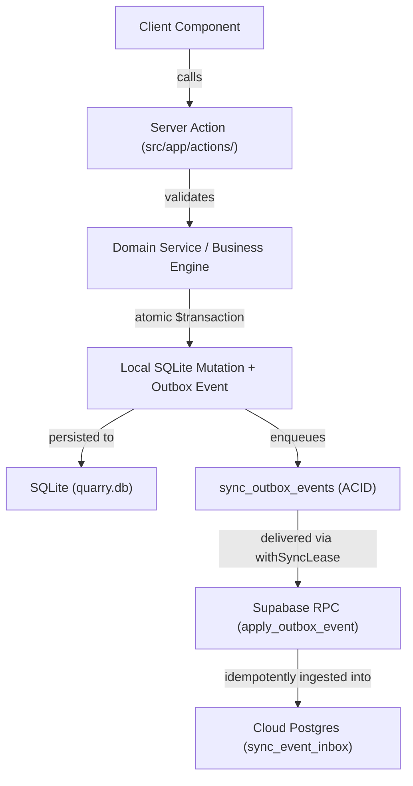

# MBM Quarry ERP — Architecture

## Runtime Stack
- **Frontend & API**: Next.js 14 (App Router, RSC)
- **Database**: SQLite via Prisma ORM (`prisma/dev.db` in dev, `%APPDATA%/mbm-quarry-erp/quarry.db` in production)
- **Desktop Shell**: Electron (wraps the Next.js standalone server)
- **Cloud Sync**: Supabase (secondary, offline-first queue)

## Source Layout & Folder Structure

*   **desktop/**: Contains the Electron wrapper code (e.g., `main.js`). Responsible for launching the Next.js server locally, managing application window lifecycle, handling database file operations, and managing database persistence/fallback operations (like the Factory Reset fallback).
*   **prisma/**: Contains the Prisma schema (`schema.prisma`), migrations, seed scripts (`seed.ts`), and development/bundled local SQLite database files (`dev.db`).
*   **scripts/**: Utility and build-time tooling scripts (e.g., manual database migration script `migrate.js`, version stamping `stamp-version.js`).
*   **src/**: The core Next.js application codebase.
    *   **src/app/**: Next.js 14 App Router definitions, routes, pages, RSCs, layouts, and server action endpoints (`src/app/actions/`).
        *   **src/app/settings/**: Contains unified diagnostic, sync, backup, and log view tabs nested within `layout.tsx`.
    *   **src/components/**: Reusable React components (UI elements, domain module forms, layout shells).
    *   **src/lib/**: Core business logic, database access, utilities, and background cloud sync engine.
        *   **src/lib/domain/**: Domain-driven service modules (e.g., inventory, daybook, ledger) isolating business rules from UI components.
        *   **src/lib/bootstrap.ts**: Raw SQLite schema initialization, table migrations, and fallback setups.
        *   **src/lib/prisma.ts**: Prisma client instantiation and database connections.
        *   **src/lib/sales-engine.ts**: Business engine for pricing, GST, rate calculations, and invoice totals.
        *   **src/lib/offline-actions.ts**: Core server actions for local database operations.
*   **main.js**: Electron main process entry point handling server spawning and IPC.
*   **package.json**: Defines project dependencies, Next.js standalone build scripts, and electron-builder packaging configurations.
*   **docs/**: Master system documentation, business rules, architectural specs, and ADR logs.

## Data Flow

## Financial Event Invariants
- Facts (Domain Events, Financial Events) are **immutable**.
- Ledger, Day Book, Reports, and Dashboard are **rebuildable projections**.
- Corrections never edit prior events — they create new `SALE_CORRECTED` / `SALE_VOIDED` events.
- See `docs/architecture/FINANCIAL_EVENT_ARCHITECTURE.md` for the full reference.

## Core Invariants
1. Business logic belongs in domain services, never in UI components.
2. Offline operation must always remain functional — SQLite is the primary source of truth.
3. Every local mutation must atomically record an outbox event in the same transaction.
4. Cloud sync is strictly idempotent; retry attempts never duplicate data or rename records.
5. Projections are disposable and rebuildable from the event stream.
6. Restores must run via isolated staging databases (`.stage.db`) with pre-restore `.bak` backups.

## Electron Data Persistence & Migrations
- App code (in `Program Files` / `.app`) is fully decoupled from app data (`%APPDATA%/quarry.db`).
- On app launch, `src/lib/migrations.ts` runs deterministic versioned migrations (`schema_migrations`), ensuring seamless forward-compatible database upgrades.
- App upgrades **never** overwrite business data.

## Related Docs
- `docs/reference/DEPLOYMENT.md` — packaging, release and update workflow
- `docs/database/DATABASE_MAP.md` — database schema and migration architecture
- `docs/architecture/FINANCIAL_EVENT_ARCHITECTURE.md` — full event system reference
- `docs/reference/BUSINESS_RULES.md` — quarry-specific business rules
- `docs/decisions/DECISION_LOG.md` — long-lived architecture decisions

## 🚨 MANDATORY DATABASE CHANGE PROTOCOL

This project uses a unified, versioned migration runner for SQLite and deterministic schema generation:
1. `prisma/schema.prisma` (Primary schema contract)
2. `src/lib/migrations.ts` (Deterministic SQLite DDL migrations v1...vN)
3. `supabase/migrations/` (PostgreSQL parity migrations & RPC functions)
4. `supabase/release-manifest.json` (SHA-256 release checksum manifest)

**Every DB change MUST follow this protocol:**
1. Update `prisma/schema.prisma`.
2. Append a new versioned migration in `src/lib/migrations.ts` (`ALL_MIGRATIONS`).
3. Run `npm run prebuild` to regenerate `bootstrap-ddl.json`, `sync-map.json`, and `schema_pg.prisma`.
4. Run `npm run phase2:manifest` to update `supabase/release-manifest.json`.
5. Run full verification suite (`npm run phase1:verify && npm run phase2:verify`).
